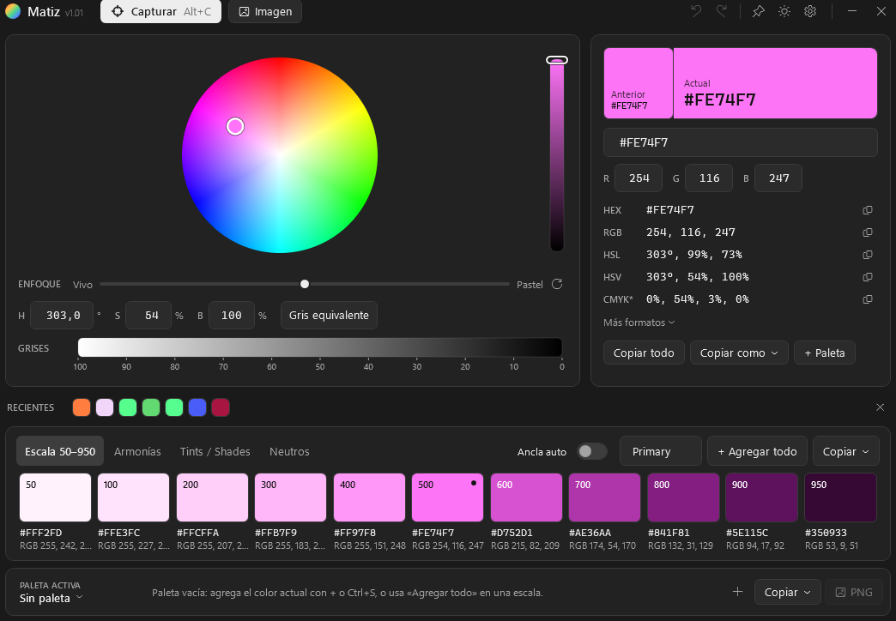
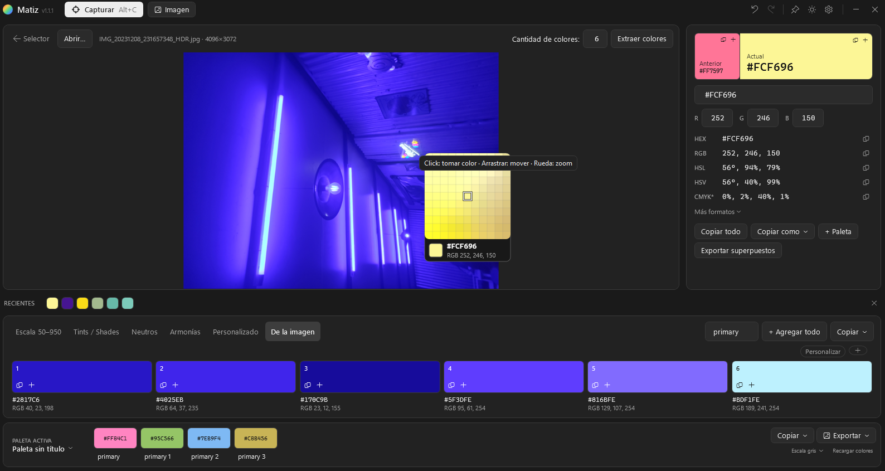

# Matiz

**English** · [Español](README.es.md)

A small, fast Windows color tool for developers and designers: pick any pixel on screen, understand it in every format, build palettes and copy them straight into your code.

**Alt+C → click any pixel → copied → scale / harmonies → copy as code → back to work.**




## Features

- **Screen picker**: global hotkey (`Alt+C`, configurable), magnifier with pixel grid, multi-monitor and per-monitor DPI aware, pixel-accurate.
- **Visual picker**: hue/saturation wheel (white center), brightness bar showing the color itself, Vivid ↔ Pastel focus, precise H/S/B inputs and a gray scale.
- **Every format**: HEX, RGB, HSL, HSV, CMYK (approx.), OKLCH, plus code snippets (CSS, C#/WPF, XAML, Flutter/Dart, ARGB). Paste any format to set a color.
- **Design scale 50–950** generated in OKLCH, ready for design systems.
- **Harmonies** (complementary, analogous, split, triadic, tetradic, monochromatic) drawn on the wheel, with balanced lightness.
- **Tints / shades, neutrals** and **dominant colors from images** (open, drop or paste a screenshot).
- **Saved palettes** with autosave, reordering and undo; export as **CSS variables, JSON, Dart, C#, Tailwind** or a **PNG** image.
- Recent colors, undo/redo, light/dark theme, always-on-top, keyboard shortcuts.

> The UI is currently in Spanish.

## Requirements

- Windows 10/11 x64.
- To build: [.NET 10 SDK](https://dotnet.microsoft.com/download).
- To run: nothing (standalone build) or the .NET 10 Desktop Runtime (light build).

## Build

Open `Matiz.sln` in Visual Studio, or use the script:

```powershell
.\build.ps1            # build (Release) + tests
.\build.ps1 run        # build and launch
.\build.ps1 publish    # publish\win-x64\Matiz.exe         (light, ~1.4 MB, needs .NET 10 Desktop Runtime)
.\build.ps1 native     # publish\win-x64-native\Matiz.exe  (single precompiled .exe, ~143 MB, no .NET needed)
.\build.ps1 all        # clean + build + tests + both publishes
```

User data lives in `%APPDATA%\Matiz\` (palettes, history, settings).

## Publish to Microsoft Store

The MSIX packaging does not use Visual Studio or `.wapproj`: `.\build.ps1 msix` runs a self-contained `win-x64` `dotnet publish`, assembles the layout and builds the package with the Windows SDK's `makeappx` (needs a **Windows 10/11 SDK** installed).

1. **Reserve the app**: in [Partner Center](https://partner.microsoft.com/dashboard) → *Windows apps* → reserve the name (already reserved: `JuanQuiroga.Matiz`).
2. **Package identity**: on the app's *Product identity* page, copy **Package identity name** and **Publisher** into `packaging/Matiz.Package/Package.appxmanifest` (`Identity Name` / `Identity Publisher`; already set to `JuanQuiroga.Matiz` / `CN=C7BB1DDD-DF8A-49EF-8538-8D09EF4F231B`).
3. **Version bump** (if needed): raise it in both **`Directory.Build.props` → `<Version>`** and the manifest → `<Identity Version>` **in the same commit** (`1.0.2` → `1.0.2.0`); the build fails if they drift apart. The Store version must only ever go up.
4. **Assets**: if missing, regenerate the PNGs with `packaging/Matiz.Package/Generate-Assets.ps1`.
5. **Local side-load test**, optional: `.\build.ps1 msix -Cert` creates a test certificate and installs the signed MSIX (UAC prompt to trust the cert); double-click the generated `.msix`.
6. **Build the package**: `.\build.ps1 msix` → `publish/msix-store/JuanQuiroga.Matiz_<version>_x64.msixupload`.
7. **Complete the submission** in Partner Center: short/long description, screenshots, 300x300 listing icon, privacy policy URL (link to the repo README), age rating, pricing, and upload the `.msixupload`.
8. **Once the Store release is approved**: create the GitHub release with `publish/win-x64-native/Matiz.exe` (noting which Store version it matches).

## Project

- `src/Matiz.Core` — color model, conversions, palette generation, export, persistence (no UI, cross-platform).
- `src/Matiz.App` — WPF app (MVVM), custom controls, screen capture.
- `tests/` — xUnit (139 tests).
- `openspec/` — spec-driven specifications.
- `docs/vault/` — full documentation as an Obsidian vault (start at `00 Inicio`).

Windows only for now (WPF). A path to Linux/macOS via Avalonia is documented in `docs/vault/01 Producto/Multiplataforma.md`.

## License

Apache 2.0 with the [Commons Clause](https://commonsclause.com/): free to copy, modify, build and distribute; selling the software itself is reserved to the author. See [LICENSE](LICENSE).

## Support the project

If Matiz is useful to you, you can invite me a coffee on Cafecito or donate via PayPal — it all goes to keeping the project alive:

<a href="https://cafecito.app/juanquiroga"></a> <a href="https://www.paypal.com/ncp/payment/PJXDUSBHSE8DE"></a>
