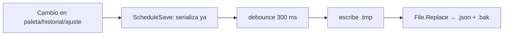

# Flujo de persistencia

```mermaid
flowchart LR
  A[Cambio en paleta/historial/ajuste] --> B[ScheduleSave: serializa ya]
  B --> C[debounce 300 ms]
  C --> D[escribe .tmp]
  D --> E[File.Replace → .json + .bak]
```
- Al cerrar: `FlushAll()` guarda lo pendiente.
- Al abrir: JSON corrupto → se renombra `*.corrupt-fecha.json` y se avisa.

Ver [[Persistencia JSON]].
