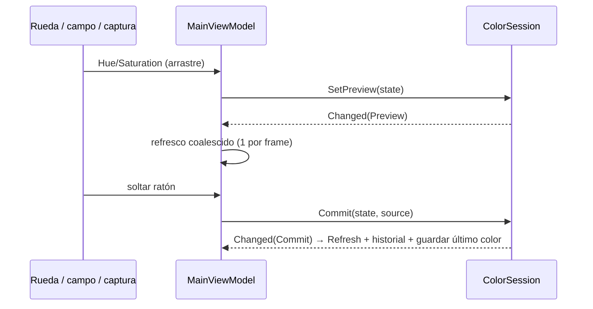

# Flujo de un cambio de color

- **Preview**: no entra en deshacer. **Commit**: actualiza anterior/actual y la pila de deshacer.
- Fuentes que añaden al [[Historial]]: captura, imagen, entrada manual.

Ver [[Fuente única de verdad]].
