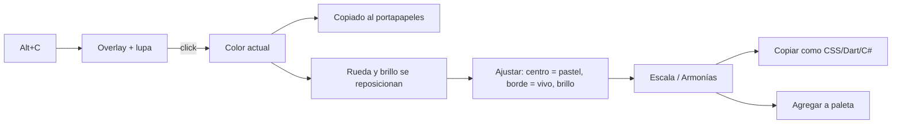

# Flujo principal Alt+C

```mermaid
flowchart LR
  A[Alt+C] --> B[Overlay + lupa]
  B -->|click| C[Color actual]
  C --> D[Copiado al portapapeles]
  C --> E[Rueda y brillo se reposicionan]
  E --> F[Ajustar: centro = pastel, borde = vivo, brillo]
  F --> G[Escala / Armonías]
  G --> H[Copiar como CSS/Dart/C#]
  G --> I[Agregar a paleta]
```
1. [[Captura de pantalla]] → 2. [[Selector visual]] → 3. [[Paletas generadas]] → 4. [[Exportación de código]] / [[Paletas guardadas]].
