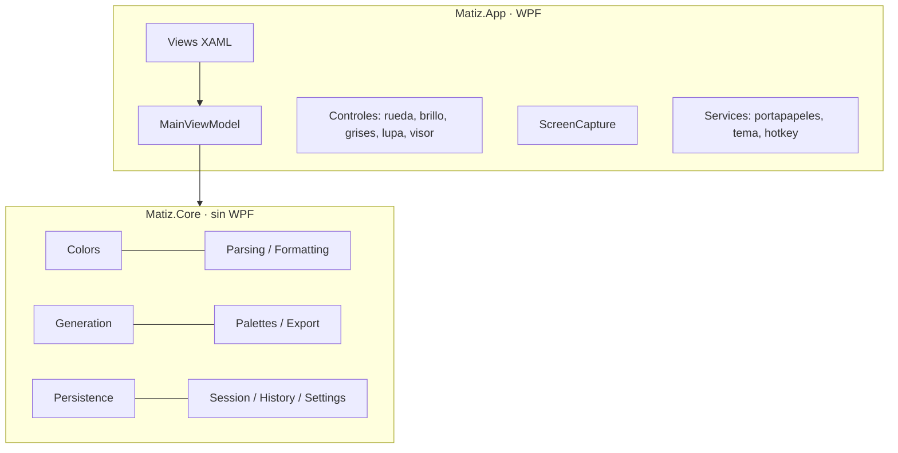

# Arquitectura general

- Dos proyectos + tests → [[ADR-006 Dos proyectos]].
- MVVM con CommunityToolkit.Mvvm; composición manual en `App.xaml.cs` (sin contenedor DI).

Detalles: [[Matiz.Core]] · [[Matiz.App]] · [[Mapa del código]]
